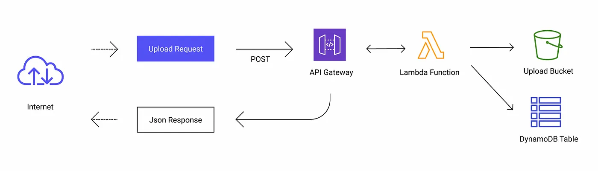
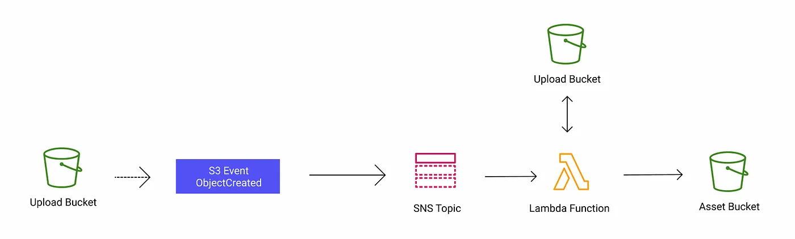
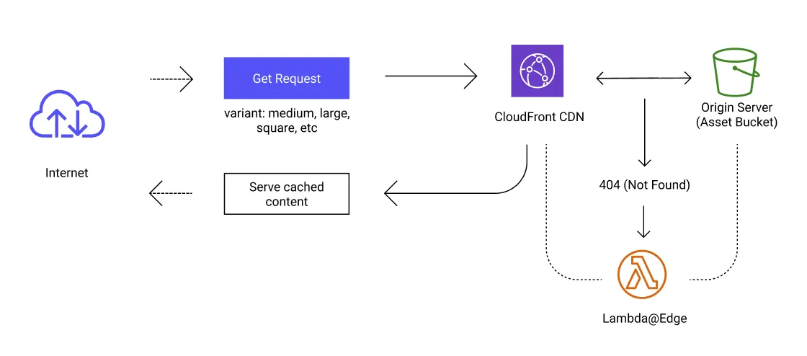

import Gist from 'react-gist';

Building a Scalable Image Service with Amazon S3 + CloudFront, DynamoDB and Lambda
==================================================================================

In this guide, I’ll walk you through the steps to create a scalable image service using Amazon Web Services (AWS) components: S3, CloudFront, DynamoDB, and Lambda.

<!-- truncate -->

## Overview

### Why AWS?

Amazon Web Services (AWS) provides a suite of cloud computing services that offer scalability, reliability, and cost-effectiveness. By leveraging AWS, you can build highly available and resilient systems that can handle a wide range of workloads, including serving images at scale.

### Architecture Overview

The image service architecture comprises the following components:

*   **Amazon S3:** Serves as the primary storage for original and processed images, ensuring high durability and availability.
*   **CloudFront:** Acts as a global content delivery network, caching images at edge locations for faster delivery to users.
*   **DynamoDB:** Stores image metadata, such as filenames, dimensions, formats, and associated tags, enabling efficient search and retrieval.
*   **Lambda:** Handles image processing tasks, such as resizing, cropping, and format conversion, triggered by events from S3 or API calls.

## Design

### Image Upload

*   Users upload images via a web or mobile application.
*   The application sends the image data to an API Gateway endpoint.
*   A Lambda function receives the image, generates unique identifiers, and stores the original image in private S3 buckets. The upload bucket serves as an event source that will trigger image transformation.
*   The Lambda function extracts metadata from the image and stores it in DynamoDB.

_Be aware that Lambda has a 6MB limit for the payload size. Alternatively, you could use an S3 pre-signed URL for the upload._

### Image Processing

*   When an image is uploaded, S3 publishes event to an SNS topic that triggers a Lambda function.
*   The Lambda function retrieves the original image from upload bucket, performs the image transformation, and stores the transformed images in the S3 asset bucket, which is integrated with CloudFront for efficient content delivery. To manage storage costs effectively, the original image is deleted from the upload bucket after the transformation is completed.

### Image Delivery

*   Users request images through a web or mobile application.
*   The application constructs URLs pointing to CloudFront distributions associated with the S3 buckets.
*   CloudFront serves the cached images from the nearest edge location, reducing latency and improving performance.
*   If the requested image or transformation is not cached, CloudFront fetches it from S3. If the fetch from S3 results in a 404 error (image not found), Lambda@Edge will be triggered to serve a default image. Alternatively you can set up CloudFront with [origin failover](https://docs.aws.amazon.com/AmazonCloudFront/latest/DeveloperGuide/high_availability_origin_failover.html) (_fallback to another S3 bucket or a web server)_ for scenarios that require high availability.

### Managing Image Metadata with DynamoDB

While S3 efficiently stores and serves our images, DynamoDB plays a crucial role in managing associated metadata. This metadata includes essential information about each image, such as:

*   **Unique Identifier:** A unique ID generated during the upload process to distinguish each image.
*   **Filename:** The original filename of the uploaded image.
*   **Dimensions:** Width and height of the original and processed images.
*   **Formats:** The image formats (e.g., JPEG, PNG).
*   **Tags:** User-defined tags or categories for easier image organization and search.
*   **Upload Timestamp:** The date and time the image was uploaded.

**Use Cases for DynamoDB in Image Management**

*   **Image Search:** Users can search for images based on specific criteria, such as tags, dimensions, or upload date.
*   **Image Filtering:** Filter images based on metadata attributes to display relevant subsets.

## Cost Estimation

Let’s assume we have a social media app with 40K daily active users. 30% of them upload one new image per day, with an average image size of 1.5 MB. Our system transforms the image into several variants and reduces the image size by ~85% of the original size. The other 70% are primarily readers, viewing an average of 50 images per day, with average image size of 75 KB. This translates to:

*   **Write Traffic:** 12K users * 1 request * 30 days = 360K requests / month
*   **Read Traffic:** 28K users * 15 requests * 30 days = 12.6M requests / month
*   **Write Throughput:** 360K requests * 1.5 MB = 540 GB/ month
*   **Read Throughput:** 12.6M requests * 75 KB = 901 GB / month
*   **Transformed Images Storage:** 120KB compressed original image + 75KB medium image + 35KB small image = 230 KB / image processed

And the components we are using are:

*   1 AWS Lambda for upload, with memory size 128MB and average execution time of 300ms / invocation
*   1 AWS Lambda for transform, with memory size 320MB and average execution time of 2s / invocation
*   1 AWS Lambda@Edge to handle 404 response from origin server, with memory size 128MB and average execution time of 150ms
*   1 Amazon API Gateway with HTTP API
*   1 Amazon DynamoDB table with on-demand capacity mode
*   1 Amazon CloudFront CDN Distribution
*   1 Amazon S3 standard bucket for upload, and 1 for asset storage

Assuming we are hosting in ap-southeast-1 region to serve customers in APAC. Below is the detailed estimation, which totals $23.81 per month.

<Gist id="7721afb76d032050e035f4a4c20a6342"/>

## Benefits

*   **Scalability:** The architecture leverages the inherent scalability of AWS services, handling increasing image volumes and user requests seamlessly.
*   **Performance:** CloudFront’s global network ensures fast image delivery to users worldwide.
*   **Cost-efficiency:** S3’s tiered storage options and Lambda’s pay-per-execution model optimize costs.
*   **Flexibility:** The service can be easily extended to support additional image processing features or integrations with other AWS services.

## Conclusion

Building a scalable image service with Amazon S3, CloudFront, DynamoDB, and Lambda provides a powerful solution for managing and delivering images efficiently. This architecture enables you to focus on your core application while AWS handles the complexities of image storage, processing, and delivery. By leveraging these managed services, you can create a high-performing, cost-effective, and scalable image infrastructure that meets the demands of modern web applications.

**_Note:_** _This article provides a conceptual overview. The actual implementation may involve additional considerations and configurations based on specific requirements._

Bonus: I’ve provided the CloudFormation template to deploy the necessary AWS resources. Go check it out at my github repository [https://github.com/yezarela/image-service-cf/](https://github.com/yezarela/image-service-cf/)