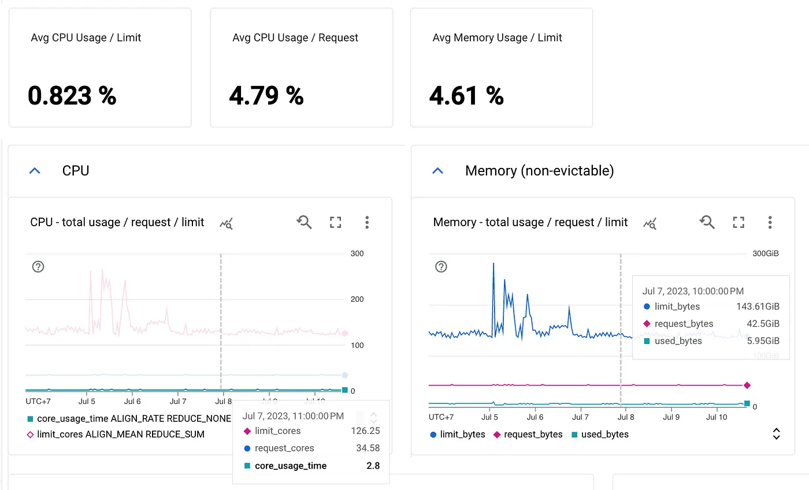

Optimizing Costs of Google Kubernetes Engine
============================================


With increasing need for flexibility, scalability and cost-effectiveness, many organizations decided to migrate and leverage the benefits of cloud infrastructure. But ironically, cloud spending has become one of the biggest cost center for many businesses. While the cloud offers great advantages, it can also lead to higher expenses if not managed effectively.

<!-- truncate -->

This led us to take a closer look at how we were using cloud resources, especially in our Google Kubernetes Engine (GKE) clusters. Let’s dig into how we could optimize our GKE cost by cutting ~75% of spending.


## Identify the Usage

Identifying resource consumption is the first step of optimization, we need to get information about how much resources requested by our services vs the actual usage. Fortunately, GKE provides us enough data to see, from optimization recommendations to utilization metrics.

*   GKE cluster cost optimization recommendation: This is the fastest way to get the total utilizations in a cluster and recommended node size based on utilizations.
*   GKE workload cost optimization recommendation: This gives us quick actual usage vs requested resource of each workloads in certain time-range.
*   CPU & Memory utilization metrics: This gives us a more detailed utilizations data of every workloads and a more flexible way to visualize it. Thankfully, GKE already comes with its monitoring dashboards, the most useful one in this case is [GKE Compute Resources — Workload View](https://console.cloud.google.com/monitoring/dashboards/integration/gke.gke-compute-resources-workload-view).



At the end of this step, we found out that our total utilizations never went above 10%. Additionally, almost all of the workloads didn’t even reach 10% of resources they requested, which conclude that we have been over-allocating resources.

## Optimization Plan

After having the big picture of our usage, next step is optimization planning. For the context, we were using GKE cluster with 1 node pool (node autoscaler enabled) with average 5 nodes running with 8 vCPU and 32 GB memory in every nodes. We have 20 micro services running in this cluster, each with their fixed number of replicas. To give an idea, GCP charges about $263 per month for every node.

Since this is a production cluster, we should not aggressively change everything, so I started with some plan I have in mind:

### Enabling HPA (Horizontal Pod Autoscaler)

For an unknown reason, pod autoscaling has not been activated in any of the workloads. Instead, a fixed number of replicas. After seeing the utilizations, it becomes evident that enabling autoscaling is essential for optimizing efficiency. I’m planning to use CPU utilization as the autoscaling metric with target 60% of utilizations, which means that our workloads has a 40% CPU buffer for handling requests while new replicas are spinning up.

```
Target CPU Utilization: 60%
```

### Workload Rightsizing

This is an obvious way we need to do considering the low utilizations, but the sizes may vary on each workloads depend on their utilizations. I’m planning to create a new sizes which is based on average mean and max usage in the last 7 days, while keeping it at 60% of the new size.

```
New CPU request formula:
- Average (mean, max usage) * 1000m / 60 * 100
- Rounded up to nearest 50
- Minimum value is 100m
New Memory request formula:
- Average (mean, max usage) * 1000M / 60 * 100
- Rounded up to nearest 50
New Limits formula:
- Use the same amount of memory for requests and limits 
- The CPU limit will be set at twice the value of the CPU request
```

Some of the decisions here are based on best practices for running cost-optimized GKE by Google which can be seen [here](https://cloud.google.com/architecture/best-practices-for-running-cost-effective-kubernetes-applications-on-gke).

### Node Rightsizing

After enabling HPA and rightsizing workloads, there could be opportunity for us to rightsize the node after reviewing the actual usage.

## Time to Optimize!

We began with **enabling HPA** on some low-traffic to high-traffic services, and completed it in 3 days. I used kubectl and [kube-capacity](https://github.com/robscott/kube-capacity) to monitor the HPA target and resource utilizations. The outcome? Nearly all services now require only a single replica. After completing this, our cluster’s node count dropped drastically from 5 to 3 nodes! This change saved us around $526 per month!

```sh
kubectl get hpa
kube-capacity --pods
```

The next step is **workload rightsizing**. The strategy is still the same, we began with the low-traffic services to high-traffic ones and completed it in 3 days. I still use the same tools to monitor the utilizations and the services are still running well. This results in 1 more node reduction and $263 saving per month! Our node count has now dropped from 3 to 2!

After reviewing the total utilizations in a few days after workload rightsizing, we found out that we have an opportunity to **rightsize the node** as expected. The plan is to downsize node from 8 vCPU and 32 GB memory to 6 vCPU and 12 GB memory.

Rightsizing the node can be accomplished by creating a new node with new size and migrating all the workloads to the new node. Thanks to the `kubectl cordon` feature, this process can be executed without any downtime. I started with creating the new node pool with the new size.

**Isolate the old node pool**: This operation marks the nodes in the existing node pool (`old-pool`) as _unschedulable_. Kubernetes stops scheduling new Pods to these nodes once we mark them as _unschedulable_**.**

```sh
for node in $(kubectl get nodes -l cloud.google.com/gke-nodepool=old-pool -o=name); do
    kubectl cordon "$node";
done
```

**Drain the existing node pool:** This operation relocates the workloads running on the nodes of the existing node pool (`old-pool`) gracefully.

```sh
for node in $(kubectl get nodes -l cloud.google.com/gke-nodepool=old-pool -o=name); do
    kubectl drain --force --ignore-daemonsets --delete-emptydir-data --grace-period=10 "$node";
done
```

And finally we can delete the old node pool. This step saves us about $100 per month for each node!

## Conclusion

At the end, we could save about 75% of our cost spending for GKE with no downtime.

In the fast-paced world of cloud infrastructure, striking a balance between cost and cloud efficiency is a never-ending process. It’s important to regularly review your usage and costs to identify new opportunities for savings. The cloud can unlock countless benefits, but it can also quietly drain your budget.