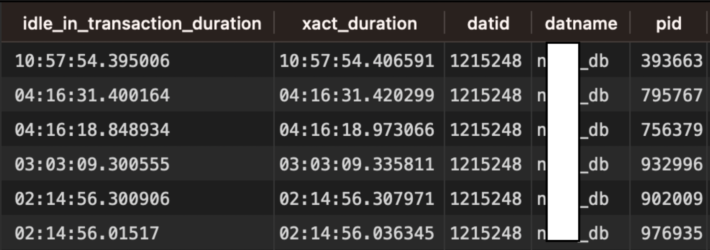

# Resolving Postgres Idle in Transaction Errors: An Effective Solution

Once upon a time, on a fine weekend, while I was hanging out with my friends, a work chat notification popped up with a beautiful message:

:::danger
remaining connection slots are reserved for non-replication superuser connections
:::

<!-- truncate -->

This meant our DB instance connection was full. It was time for the Avengers to assemble! All backend and DevOps team members went online to investigate the root cause. Thanks to the Cloud SQL monitoring dashboard, we quickly discovered an anomaly in the number of connections in <span className="purple-text">idle in transaction</span> state in one of our databases.

## What is "idle in transaction" state

Picture this: You're in a crowded cafe, ready to tackle a big project. You claim a table (BEGIN transaction), order a coffee... and then proceed to stare into space, pondering the mysteries of life. That's your database connection in <span className="purple-text">idle in transaction</span> state. It has everything it needs to start working, but it's just... sitting there.

:::info
In other words, this means the transaction is open (inside BEGIN) but is currently inactive or idle.
:::

## How to check "idle in transaction" queries

Imagine the cafe manager, slightly annoyed at your table-hogging. They peek over your shoulder and politely ask, "Excuse me, sir, how long have you been <span className="purple-text">idle in transaction</span>? Also, might I inquire about your `xact_start` time?". That's essentially what this query does:

```sql
SELECT NOW() - state_change AS idle_in_transaction_duration, NOW() - xact_start AS xact_duration,*
FROM pg_stat_activity
WHERE state  = "idle in transaction"
AND xact_start IS NOT NULL
ORDER BY 1 DESC;
```

And you will see long-running queries with connection state of <span className="purple-text">idle in transaction</span> like this. Apologies for the 10-hour idle duration! That's definitely not ideal. 😢



## How to prevent "idle in transaction" state

### Database Configuration

Back to our cafe scenario. The manager, having had enough of your daydreaming, tactfully suggests, "Perhaps we could set a little <span className="purple-text">idle_in_transaction_session_timeout</span> for your table? You know, just to make sure everyone gets a chance to enjoy our fine establishment." In Postgres terms, this means setting a limit on how long a transaction can remain idle before getting politely kicked out.

```sql
ALTER DATABASE database-name SET idle_in_transaction_session_timeout='60s'
```

You can verify the configuration by running this query:

```sql
SELECT name, setting FROM pg_settings
WHERE name = 'idle_in_transaction_session_timeout';
```

### Application Code Best Practices

- **Keep transactions short:** Avoid performing lengthy computations or blocking operations within a transaction. If necessary, break down complex transactions into smaller ones.
- **Explicitly commit or rollback:** Always explicitly commit or rollback transactions when they are no longer needed. Relying on implicit commits or auto-commits can lead to transactions remaining open for longer than necessary.
- **Handle errors gracefully:** Implement proper error handling mechanisms to ensure that transactions are rolled back in case of errors. Unhandled exceptions can leave transactions open, leading to the "idle in transaction" state.

## Wrapping Up

The idle in transaction state in Postgres is like that moment of procrastination we all experience from time to time. It's harmless in small doses, but if left unchecked, it can lead to problems. By understanding this state, monitoring for idle transactions, and setting appropriate timeouts, you can keep your database running smoothly and efficiently. Remember, a happy database is a productive database!

### References

- [https://stackoverflow.com/questions/51019/what-does-it-mean-when-a-postgresql-process-is-idle-in-transaction](https://stackoverflow.com/questions/51019/what-does-it-mean-when-a-postgresql-process-is-idle-in-transaction)
- [https://docs.aws.amazon.com/AmazonRDS/latest/AuroraUserGuide/proactive-insights.idle-txn.html](https://docs.aws.amazon.com/AmazonRDS/latest/AuroraUserGuide/proactive-insights.idle-txn.html)
- [https://www.postgresql.org/docs/current/runtime-config-client.html#GUC-IDLE-IN-TRANSACTION-SESSION-TIMEOUT](https://www.postgresql.org/docs/current/runtime-config-client.html#GUC-IDLE-IN-TRANSACTION-SESSION-TIMEOUT)
