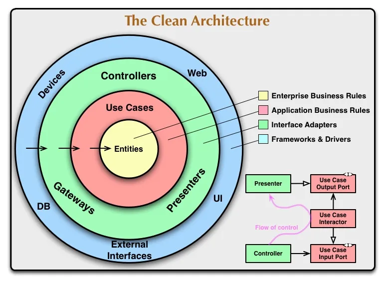

Unveiling Clean Architecture: Guidelines, Benefits, and Trade-offs
==================================================================

You may have heard about Clean Architecture before and still figuring out what that is and what it is trying to solve, yes I was there too. In this post, I’ll try to explain and summarize Clean Architecture from some sources I read in a simple and hopefully quite straightforward way for engineers to understand.

<!-- truncate -->

## What is Clean Architecture?

Clean architecture is a software design philosophy that **separates** the elements of a software design into ring levels. An important goal of clean architecture is to provide developers with a way to organize code in such a way that it encapsulates the business logic but keeps it separate from the delivery mechanism. As you can see in the image below, there are some common layers used in Clean Architecture to fit this goal:

We will talk about what each layer does later, but first let’s see what is actually the purpose of this design, what is Clean Architecture trying to solve?

*   **Independent of Frameworks**. The architecture does not depend on the existence of some library of feature laden software. This allows you to use such frameworks as tools, rather than having to rely on their limited constraints.
*   **Testable**. The purer a function, class or module is, the easier it is to predict the result. The business rules can be tested without the UI, Database, Web Server, or any other external element.
*   **Independent of UI**. The UI can change easily, without changing the rest of the system. A Web UI could be replaced with a console UI, for example, without changing the business rules.
*   **Independent of Database**. You can swap out MySQL or PostgreSQL, for MongoDB, BigTable, CouchDB, or something else. Your business rules are not bound to the database.
*   **Independent of any external element**. If at some point your system need a library, another system or any element to connect, it should be easily assembled and modularized. In fact, for the system, this outer layer should be abstracted.

## Rule of Clean Architecture

:::info
_Source code dependencies can only point inwards, nothing in an inner circle can know anything at all about something in an outer circle_.
:::

The above statement is the core principle when designing with Clean Architecture. Each layer should not know anything at all about how will it consumed by the outer layer.

1.  **Entities / Models / Domains**
    
    This layer encapsulate _Enterprise wide_ business rules, least likely to change when something external changes.
2.  **Use Cases**

    Set of application business rules. We do not expect changes in this layer to affect the entities. We also do not expect this layer to be affected by changes to externalities such as the database, the UI, or any of the common frameworks.
3.  **Interface Adapters**
    
    Set of adapters that convert data from the format most convenient for the use cases and entities, to the format most convenient for some external agency such as Web, UI, Devices.
4.  **Frameworks and Drivers**
    
    The outermost layer is generally composed of frameworks and tools such as the Database, the Web Framework, etc. This layer is where all the details go. The Web is a detail. The database is a detail. We keep these things on the outside where they can do little harm.

There’s no rule that says you must always have just these four. However, _The Dependency Rule_ always applies. As you move inwards the level of abstraction increases.

## What are the Pros and Cons of using Clean Architecture?

As we often hear the tired old cliché that says _“there is no silver bullet”_, yes this also applies in software architecture design. Let’s see what are the pros first:

*   Consistent business logic through the app
*   Swappable data persistence, external systems integration, and presentation
*   Enables carving out a vertical feature slice into a separate service (microservice, nanoservice, serverless) without much difficulty
*   Promotes more testable design patterns (Core business logic tends to always be testable)

And what are the cons?

*   Requires more intentional design (you can’t reference data persistence APIs directly in your business logic)
*   Due to the business logic being agnostic of the outer layers you can loose optimizations in being closer to library features and implementations with the benefit of looser coupling
*   Can be overkill when only a CRUD app is needed

## Conclusion

Clean Architecture helps us to write maintainable code, by the fact that its layers are independent. Thus, changes to certain part tend not to interfere with the rest of the application. This architecture is ideal when you have a long-term project.

On the other hand, this requires more time to work on and takes longer time for just a simple MVP application to see the first results.

It is good to know Clean Architecture principles but it is better to use them wisely otherwise your solution can become overcomplicated with too many unnecessary abstractions and interfaces.

This post is summarized from some articles I read when trying to understand Clean Architecture, please read the links below for more:

*   [https://blog.cleancoder.com/uncle-bob/2012/08/13/the-clean-architecture.html](https://blog.cleancoder.com/uncle-bob/2012/08/13/the-clean-architecture.html)
*   [https://dev.to/hurricaneinteractive/clean-architecture-your-approach-5ae6](https://dev.to/hurricaneinteractive/clean-architecture-your-approach-5ae6)
*   [https://dev.to/rubemfsv/clean-architecture-the-concept-behind-the-code-52do](https://dev.to/rubemfsv/clean-architecture-the-concept-behind-the-code-52do)
